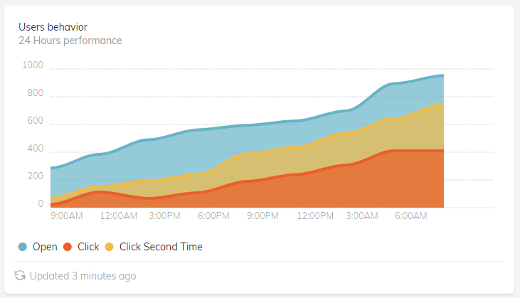
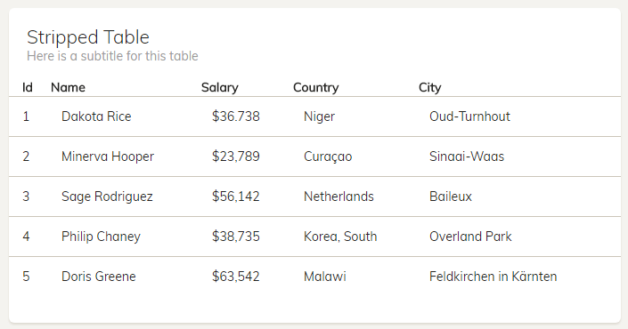

## Short summary
Besides giving the existing Bootstrap elements a new look, we added new ones, so that the interface is consistent and homogenous.
New components are either UI components or components as Plugins which need some more information than simple props.

Below is the list of new, customized components:

- [StatsCard](/components?id=statscard)
- [ChartCard](/components?id=chartcard)
- FormGroupInput
- [PaperTable](/components?id=papertable)

## StatsCard 
#### [Demo](https://cristijora.github.io/vue-paper-dashboard/#/admin/overview)


#### Usage
Template
```vue
<stats-card>
  <div class="icon-big text-center" class="icon-success" slot="header">
    <i class="ti-server"></i>
  </div>
  <div class="numbers" slot="content">
    <p>Capacity</p>
    105GB
  </div>
  <div class="stats" slot="footer">
    <i class="ti-reload"></i> Updated now
  </div>
</stats-card>
```
Javascript
```js
import StatsCard from 'components/UIComponents/Cards/StatsCard.vue'
export default{
    components:{
        StatsCard
    }
}
```
#### Slots:
| Name          |
| ------------- |
| header        |
| content       |
| footer        | 


## ChartCard 

### [Demo](https://cristijora.github.io/vue-paper-dashboard/#/admin/overview)


#### Usage

Template
```vue
<chart-card :chart-data="chartData" :chart-options="chartOptions">
  <span slot="title">Users behavior</span>
  <span slot="subTitle"> 24 Hours performance</span>
  <span slot="footer">
    <i class="ti-reload"></i> Updated 3 minutes ago</span>
  <div slot="legend">
    <i class="fa fa-circle text-info"></i> Open
    <i class="fa fa-circle text-danger"></i> Click
    <i class="fa fa-circle text-warning"></i> Click Second Time
  </div>
</chart-card>
```
Javascript
```js
import ChartCard from 'components/UIComponents/Cards/ChartCard.vue'
export default{
    components:{
      ChartCard  
    },
    data(){
         return {
           chartData: {
             labels: ['9:00AM', '12:00AM', '3:00PM', '6:00PM', '9:00PM', '12:00PM', '3:00AM', '6:00AM'],
             series: [
               [287, 385, 490, 562, 594, 626, 698, 895, 952],
               [67, 152, 193, 240, 387, 435, 535, 642, 744],
               [23, 113, 67, 108, 190, 239, 307, 410, 410]
             ]
           },
           chartOptions: {
             // lineSmooth: false,
             low: 0,
             high: 1000,
             showArea: true,
             height: '245px',
             axisX: {
               showGrid: false
             },
             lineSmooth: this.$Chartist.Interpolation.simple({
               divisor: 3
             }),
             showLine: true,
             showPoint: false
           }
        }
    }
}
```


#### Props:
| Name          | Type           | Default value  | Accepted values  |
| ------------- |:-------------:| ----------------------:| -----:|
| footerText        | String |             | Any string    |
| headerTitle       | String | Chart title | Any string    |
| chartType         | String | Line        | Pie/Bar       |
| chartOptions      | Object | { }         | [Chartist chart options](https://gionkunz.github.io/chartist-js/api-documentation.html#chartistline-declaration-defaultoptions)             |
| chartData         | Object | `{labels:[], series:[]}`        | [Chartist docs](https://gionkunz.github.io/chartist-js/api-documentation.html#chartistline-function-line)             |

#### Slots:
| Name          |
| ------------- |
| title        |
| subTitle       |
| legend        | 
| footer        | 


## PaperTable 
#### [Demo](https://cristijora.github.io/vue-paper-dashboard/#/admin/table-list)



#### Usage

Template
```vue
<paper-table :title="table.title" :sub-title="table.subTitle" :data="table.data" :columns="table.columns">
</paper-table>
```

Javascript 
```js
import PaperTable from 'components/UIComponents/PaperTable.vue'
export default {
    components: {
      PaperTable
    },
    data () {
      return {
        table: {
          title: 'Stripped Table',
          subTitle: 'Here is a subtitle for this table',
          columns: ['Id', 'Name', 'Salary', 'Country', 'City'],
          data: [{
                id: 1,
                name: 'Dakota Rice',
                salary: '$36.738',
                country: 'Niger',
                city: 'Oud-Turnhout'
              },
              {
                id: 2,
                name: 'Minerva Hooper',
                salary: '$23,789',
                country: 'Curaçao',
                city: 'Sinaai-Waas'
              },
              {
                id: 3,
                name: 'Sage Rodriguez',
                salary: '$56,142',
                country: 'Netherlands',
                city: 'Baileux'
              },
              {
                id: 4,
                name: 'Philip Chaney',
                salary: '$38,735',
                country: 'Korea, South',
                city: 'Overland Park'
              },
              {
                id: 5,
                name: 'Doris Greene',
                salary: '$63,542',
                country: 'Malawi',
                city: 'Feldkirchen in Kärnten'
              }]
        }
    }
  }
}
```

#### Props:
| Name          | Type           | Default value  | Accepted values  |
| ------------- |:-------------:| ----------------------:| -----:|
| columns        | Array(string)  |                 | Any array of strings    |
| data           | Array(objects) | Chart title     | Any array of objects    |
| type           | String         | Stripped        | striped/hover       |
| title          | String         | ''              | Any string           | 
| subTitle       | String         | ''              |Any string           | 

#### Slots:
| Name          |
| ------------- |
| header        |