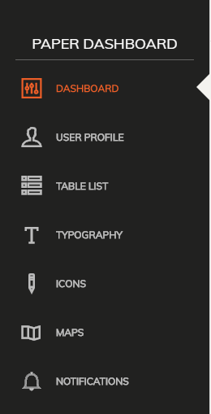
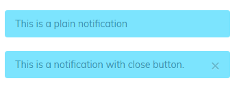

## Short summary 
Some UI elements need to be accessible in many views/components of the application.
Since simple components might not be very suitable for this case, we transformed 2 such elements into plugins 
which are easy to use and customize. 

- Sidebar
- Notifications

## Sidebar 
#### [Demo](https://cristijora.github.io/vue-paper-dashboard/#/admin/overview)



#### Usage

Plugins are usually initialized with the help of the `use` method
```js
import SideBar from './components/UIComponents/SidebarPlugin'
Vue.use(SideBar)
```

```vue
<side-bar :sidebar-links="$sidebar.sidebarLinks">
</side-bar>
```

!> We use `$sidebar.sidebarLinks` to reference the list of routes here. You can reference the routes directly from your 
component's data or vuex if you need to. You can also go in the SidebarPlugin folder and change the list of routes you need to display


#### Props:
| Name          | Type           | Default value  | Accepted values  |
| ------------- |:-------------:| ----------------------:| -----:|
| type                  | String            |  sidebar            | sidebar/navbar   |
| backgroundColor       | String | black     | black/white    |
| activeColor           | String         | danger        | primary/info/success/warning/danger       |
| sidebarLinks          | Array(objects)         | []              | An array of objects with a predefined structure          | 

#### Sidebar links structure
In order to display links correctly in the sidebar, the following structure is needed
```js
{
      name: 'Notifications',
      icon: 'ti-bell',
      path: '/admin/notifications'
}
```
#### Exposed plugin properties and methods
Sidebar plugin exposes some properties and methods in order to accomplish certain operations.
These can also be found inside SidebarPlugins/index.js file 
```js
  showSidebar: false,
  sidebarLinks: [], //this array is pre-filled with data in the project
  displaySidebar (value) {
    this.showSidebar = value
  }

```
The set of properties from above are exposed globally via `$sidebar` so we can access `this.$sidebar` in any of the components
We can use these properties and methods to show/hide sidebar or to toggle css classes based on the sidebar state
Example
```html
<div :class="{'nav-open': $sidebar.showSidebar}">
    <router-view></router-view>
    <side-bar type="navbar" :sidebar-links="$sidebar.sidebarLinks"></side-bar>
</div>
```
The `nav-open` class is displayed conditionally based on `$sidebar.showSidebar` value.
We could also add or remove sidebar links dynamically if we need to
```js
this.$sidebar.sidebarLinks.push({
                                      name: 'New link',
                                      icon: 'ti-bell',
                                      path: '/admin/newroute'
                                })
```

Feel free to add the properties or methods you need in order to accomplish more complex things. This is just a starting point so you can customize it easier.


## Notifications 
#### [Demo](https://cristijora.github.io/vue-paper-dashboard/#/admin/notifications)



#### Usage

Same as sidebar we initialize via `use` method
```js
import Notifications from './components/UIComponents/NotificationPlugin'
Vue.use(Notifications)
```

Template usage
```vue
<notifications>
</notifications>
```

!> The `<notifications>` component is just a wrapper component so you can place it pretty much anywhere in the app, but registering it
once in a component which is always present in the app (e.g main App component) should be sufficient

Javascript usage
```js
this.$notifications.notify(
          {
            message: 'Welcome to <b>Paper Dashboard</b> - a beautiful freebie for every web developer.',
            icon: 'ti-gift',
            horizontalAlign: 'top',
            verticalAlign: 'right',
            type: 'info',
            timeout: 2000
          })
```

#### Exposed plugin properties and methods

```js
  state: [], // notifications will be added here

  removeNotification (index) {
    this.state.splice(index, 1)
  },
  notify (notification) {
    this.state.push(notification)
  }
```

All operations are exposed globally via `$notifications` so we can use `this.$notifications` in every component from our app.

#### Notification object
| Property          | Type           | Accepted values  |
| ------------- |:-------------:|-----:|
| message                  | String            | any valid html   |
| icon                     | String             | any icon class   |
| verticalAlign           | String         |  top/bottom       |
| horizontalAlign          | String         | center/left/right           | 
| type                  | String         | info/success/warning/danger        | 
| timeout                  | Number         | Any number in ms (e.g 3000)     | 